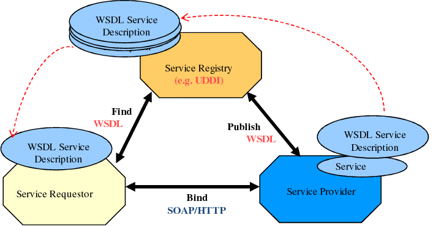

# SOA
## Partie théorique
1. **Defintion de SOA:** SOA est une service web qui permet de communiquer
plusieur Application.
2. **l'achitecture de SOAP**

3. **Les etapes d'appel pour un service web de type SOAP**
justement utiliser le wsdl pour invoket le SOA api en appelant les methode. 

## Partie Pratique
1. **Les avantages d'utilisation de service web SOAP par rapport à d'autres méthodes**
- permet la communication de plusieur entier
- dimunie la duplication du code.
2.
3. **For the implementation of the soa**
- I have created all the layer of the SOA API `db`, `dao`, `model`,`service`
- Then i have created an model called [Employer](src/main/java/model/Employer.java)
- Then i have created the [DbConnection](src/main/java/db/DbConnection.java)
- Then i have created the [DAO](src/main/java/dao/DAO.java) Interface
- Then i have created the [EmployerDao](src/main/java/dao/EmployerDao.java)
- Then i have created The [EmployerService](src/main/java/service/EmployerService.java) Interface
- Then i have created The [EmployerServiceImp](src/main/java/service/EmployerServiceImp.java)
- Then I have published The api using [ServicePublisher](src/main/java/service/ServicePublisher.java) on this url http://localhost:8080/EmployerService
